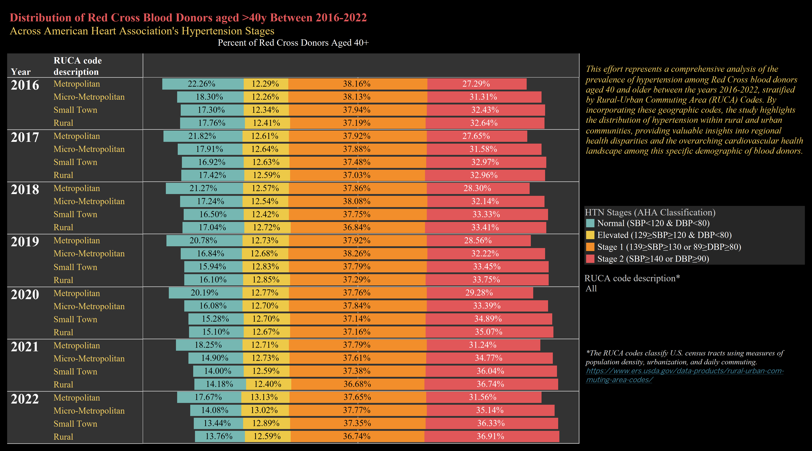

```{r setup, include=FALSE}
knitr::opts_chunk$set(echo = TRUE)
```


## **Epidemiology of hypertension among blood donors 2016-2022** {.tabset .tabset-fade .tabset-pills}
### Data{.tabset}
#### Dashboard
```{r pressure, echo=FALSE, fig.cap="Tableau Dashboard", out.width = '100%'}

```

#### Sample data
```{r class.source = 'fold-hide', warning=FALSE,  message=FALSE, results='show', echo=FALSE}
library(pacman)
pacman::p_load(readxl, dplyr, gtsummary,gt, ggplot2, wesanderson,conflicted,DT, trace = F)
conflict_prefer("filter", "dplyr")
conflict_prefer("select", "dplyr")
htn <- read.csv("E:\\ARC\\Projects\\HTN\\HTN2019_2023\\SAS\\htn_2016_23_tab.csv")
htn %>% select(year,gender, race, agegroup, status, ruca) %>% head()
# datatable(head(htn), options = list(pageLength=50, scrollX='400px'), filter = 'top')
```

### Analysis{.tabset}
#### Table 1
```{r class.source = 'fold-hide', warning=FALSE,  message=FALSE, results='show'}
htn |> filter(ruca != "") %>% 
  tbl_summary(by = ruca, include = c(race, gender)) |>
  add_p(pvalue_fun = label_style_pvalue(digits = 2)) |>
  add_overall() |>
  add_n() |>
  modify_header(label ~ "**Variable**") |>
  modify_spanning_header(c("stat_1", "stat_2", "stat_3", "stat_4") ~ "**RUCA**") |>
  modify_footnote_header("Median (IQR) or Frequency (%)", columns = all_stat_cols()) |>
  modify_caption("**Table 1. Donor Characteristics**") |>
  bold_labels()
```

#### Figures {.tabset}
##### TBD
```{r class.source = 'fold-hide', warning=FALSE,  message=FALSE, results='show'}

```

##### TBD
```{r class.source = 'fold-hide', warning=FALSE,  message=FALSE, results='show'}

```

